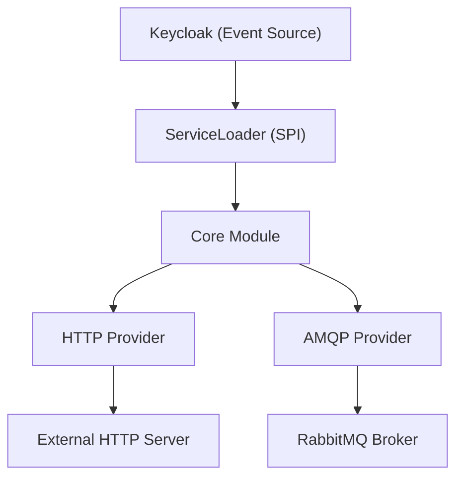

# Keycloak Webhook Plugin

A modular Keycloak event listener plugin that triggers webhooks whenever specific events (like login, registration, or
logout) occur in Keycloak. This project leverages a multi-module design so you can choose which transport provider (HTTP
or AMQP) to deploy based on your needs.

---

## 1. What It Is

The Keycloak Webhook Plugin consists of three modules:

- **Core Module (`keycloak-webhook-provider-core`)**  
  Contains common SPI interfaces, shared models, and helper utilities.

- **AMQP Provider (`keycloak-webhook-provider-amqp`)**  
  Implements webhook notifications over AMQP (e.g., RabbitMQ). If the AMQP dependency is present on the classpath, this
  provider is loaded automatically.

- **HTTP Provider (`keycloak-webhook-provider-http`)**  
  Implements webhook notifications over HTTP. This provider uses OpenAPI-generated clients to ensure compliance with the
  target API.

Keycloak uses Java’s `ServiceLoader` mechanism to conditionally load these providers at runtime if their JARs (and
dependencies) are available.

---

## 2. How to Use It

### Downloading the Plugins

Download the latest release artifacts (shaded JARs) from the GitHub releases page. For example, using `curl`:

```bash
# Replace <version> with the desired release version.

curl -L -o keycloak-webhook-provider-core.jar https://github.com/vymalo/keycloak-webhook/releases/download/v<version>/keycloak-webhook-provider-core-<version>-all.jar
curl -L -o keycloak-webhook-provider-amqp.jar https://github.com/vymalo/keycloak-webhook/releases/download/v<version>/keycloak-webhook-provider-amqp-<version>-all.jar
curl -L -o keycloak-webhook-provider-http.jar https://github.com/vymalo/keycloak-webhook/releases/download/v<version>/keycloak-webhook-provider-http-<version>-all.jar
```

### a. Docker

When running Keycloak in Docker, mount the downloaded JARs into Keycloak’s providers directory. For example, in your
`docker-compose.yaml`:

```yaml
services:
  keycloak:
    image: quay.io/keycloak/keycloak:26.1.3
    ports:
      - '9100:9100'
    environment:
      # HTTP Provider Configuration
      WEBHOOK_HTTP_BASE_PATH: "http://prism:4010"
      WEBHOOK_HTTP_AUTH_USERNAME: "admin"
      WEBHOOK_HTTP_AUTH_PASSWORD: "password"
      # AMQP Provider Configuration
      WEBHOOK_AMQP_HOST: rabbitmq
      WEBHOOK_AMQP_USERNAME: username
      WEBHOOK_AMQP_PASSWORD: password
      WEBHOOK_AMQP_PORT: 5672
      WEBHOOK_AMQP_VHOST: "/"
      WEBHOOK_AMQP_EXCHANGE: keycloak
      WEBHOOK_AMQP_SSL: "no"
      # Keycloak Admin Credentials
      KEYCLOAK_ADMIN: admin
      KEYCLOAK_ADMIN_PASSWORD: password
      KC_HTTP_PORT: 9100
      KC_METRICS_ENABLED: 'true'
      KC_LOG_CONSOLE_COLOR: 'true'
      KC_HEALTH_ENABLED: 'true'
    entrypoint: /bin/sh
    command:
      - -c
      - |
        set -ex
        # Copy all plugin JARs from the mounted volume into Keycloak's providers folder
        cp /tmp/plugins/*.jar /opt/keycloak/providers
        /opt/keycloak/bin/kc.sh start-dev --import-realm
    volumes:
      - ./plugins:/tmp/plugins:ro  # Place your downloaded JARs in this folder
      - ./.docker/keycloak-config/:/opt/keycloak/data/import/:ro
```

### b. Kubernetes

In Kubernetes, you can use an init container to download the plugin JARs from GitHub artifacts and copy them into
Keycloak’s providers folder. For example:

```yaml
apiVersion: apps/v1
kind: Deployment
metadata:
  name: keycloak
spec:
  replicas: 1
  selector:
    matchLabels:
      app: keycloak
  template:
    metadata:
      labels:
        app: keycloak
    spec:
      volumes:
        - name: providers-volume
          emptyDir: { }
      initContainers:
        - name: download-plugins
          image: curlimages/curl:8.1.2
          command:
            - sh
            - -c
            - |
              mkdir -p /plugins
              # Download the plugins from GitHub releases (update the URLs accordingly)
              curl -L -o /plugins/keycloak-webhook-provider-core.jar https://github.com/vymalo/keycloak-webhook/releases/download/v<version>/keycloak-webhook-provider-core-<version>-all.jar
              curl -L -o /plugins/keycloak-webhook-provider-amqp.jar https://github.com/vymalo/keycloak-webhook/releases/download/v<version>/keycloak-webhook-provider-amqp-<version>-all.jar
              curl -L -o /plugins/keycloak-webhook-provider-http.jar https://github.com/vymalo/keycloak-webhook/releases/download/v<version>/keycloak-webhook-provider-http-<version>-all.jar
              cp /plugins/*.jar /providers/
          volumeMounts:
            - name: providers-volume
              mountPath: /providers
      containers:
        - name: keycloak
          image: quay.io/keycloak/keycloak:26.1.3
          env:
            - name: WEBHOOK_HTTP_BASE_PATH
              value: "http://prism:4010"
            - name: WEBHOOK_HTTP_AUTH_USERNAME
              value: "admin"
            - name: WEBHOOK_HTTP_AUTH_PASSWORD
              value: "password"
            - name: WEBHOOK_AMQP_HOST
              value: "rabbitmq"
            - name: WEBHOOK_AMQP_USERNAME
              value: "username"
            - name: WEBHOOK_AMQP_PASSWORD
              value: "password"
            - name: WEBHOOK_AMQP_PORT
              value: "5672"
            - name: WEBHOOK_AMQP_VHOST
              value: "/"
            - name: WEBHOOK_AMQP_EXCHANGE
              value: "keycloak"
            - name: WEBHOOK_AMQP_SSL
              value: "no"
          volumeMounts:
            - name: providers-volume
              mountPath: /opt/keycloak/providers
```

---

## 3. Environment Variables

### HTTP Provider

- **`WEBHOOK_HTTP_BASE_PATH`**  
  The endpoint URL where webhook requests are sent.

- **`WEBHOOK_HTTP_AUTH_USERNAME` (optional)**  
  Basic auth username.

- **`WEBHOOK_HTTP_AUTH_PASSWORD` (optional)**  
  Basic auth password.

### AMQP Provider

- **`WEBHOOK_AMQP_HOST`**  
  RabbitMQ server hostname.

- **`WEBHOOK_AMQP_USERNAME`**  
  Username for RabbitMQ.

- **`WEBHOOK_AMQP_PASSWORD`**  
  Password for RabbitMQ.

- **`WEBHOOK_AMQP_PORT`**  
  Port for RabbitMQ.

- **`WEBHOOK_AMQP_VHOST` (optional)**  
  Virtual host for RabbitMQ.

- **`WEBHOOK_AMQP_EXCHANGE`**  
  Exchange name for RabbitMQ.

- **`WEBHOOK_AMQP_SSL` (optional)**  
  `"yes"` or `"no"`, indicating if SSL is enabled.

- **`WEBHOOK_EVENTS_TAKEN` (optional)**  
  A comma-separated list of Keycloak events (e.g., `"LOGIN,REGISTER,LOGOUT"`) that should trigger webhooks. If not
  specified, all events are processed.

---

## 4. Architecture

The architecture of the Keycloak Webhook Plugin is illustrated using a Mermaid diagram below:



- **Core Module:**  
  Provides common interfaces, models, and utilities.

- **Provider Modules:**  
  Implement specific webhook delivery mechanisms (HTTP or AMQP) and are conditionally loaded if their JARs are present.

- **ServiceLoader:**  
  Uses Java’s SPI to discover and load the providers.

- **External Systems:**  
  Webhook notifications are sent to an HTTP server or published to a RabbitMQ broker.

---

## 5. Contribute

We welcome contributions! To get started:

1. **Fork the Repository:**  
   Create your own fork of the project on GitHub.

2. **Set Up Your Development Environment:**

- Clone your fork locally.
- Ensure you have JDK 17 and Gradle installed.
- Build the project using:
  ```bash
  ./gradlew clean shadow
  ```

3. **Follow Code Conventions:**

- Keep the code style consistent with the existing modules.
- Write tests where applicable.
- Update the README and documentation if your changes require it.

4. **Submit a Pull Request:**  
   Open a pull request with your proposed changes. Please include a detailed description and reference any related
   issues.

5. **Join Discussions:**  
   Use GitHub issues to discuss ideas, report bugs, or ask for help.

---

This modular and flexible design allows you to deploy only the providers you need while keeping the project maintainable
and extensible. Happy coding!
